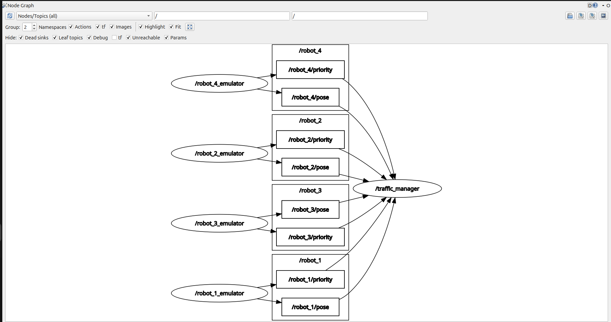
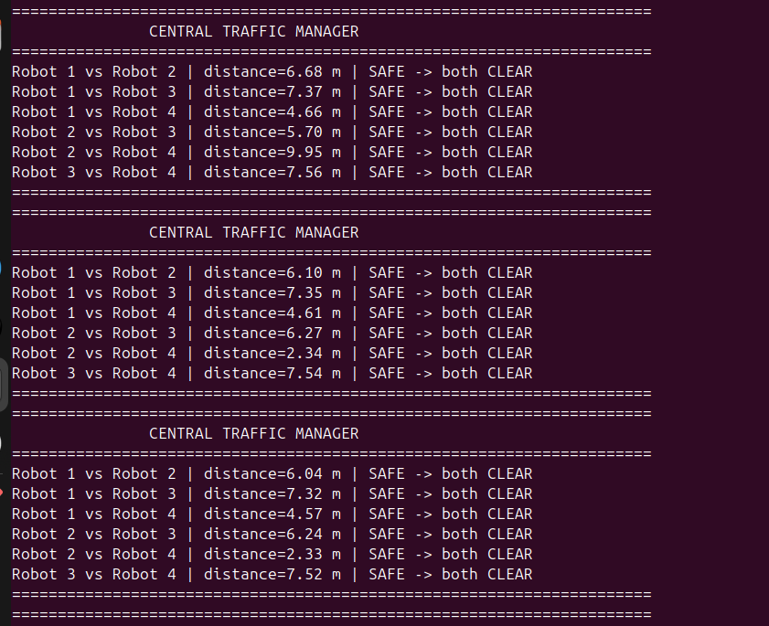
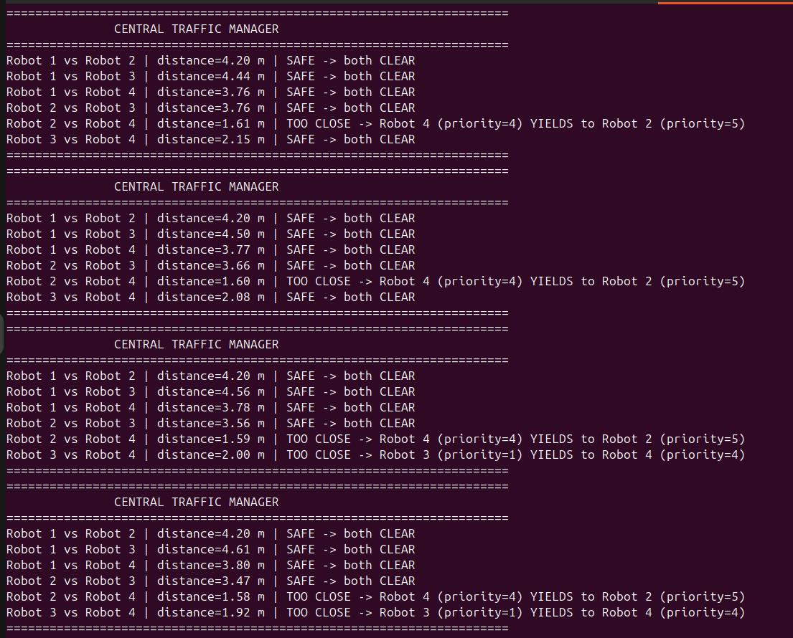

# Task 12 — Centralized Traffic Manager

## Overview
A **centralized** ROS2 system where multiple warehouse robots broadcast their
position and priority, and a single Traffic Manager node compares **every
unique pair of robots** and applies a Yielding Protocol to avoid collisions.

Unlike a decentralized design (where each robot decides for itself), all
decision-making here happens in one place: the `traffic_manager` node. The
robots themselves do nothing but report their state.

---

## File Structure
```
Task_12/
 fleet_emulator.py   : Simulates 4 robots broadcasting pose and priority
 traffic_manager.py  : Centralized controller — compares every robot pair
 README.md
```

---

## How to Run

**Terminal 1 — Start the fleet:**
```bash
cd ~/ros2_ws
source /opt/ros/jazzy/setup.bash
source install/setup.bash
ros2 run task_12 fleet_emulator
```

**Terminal 2 — Start the traffic manager:**
```bash
cd ~/ros2_ws
source /opt/ros/jazzy/setup.bash
source install/setup.bash
ros2 run task_12 traffic_manager
```

**Terminal 3 — View the RQT graph (optional):**
```bash
source /opt/ros/jazzy/setup.bash
rqt_graph
```

## Robots & Priorities

| Robot ID | Priority |
|----------|----------|
| 1        | 3        |
| 2        | 5        |
| 3        | 1        |
| 4        | 4        |

Higher number = higher priority = right of way.

---

## Yielding Protocol — Math

### Distance Calculation (Euclidean)
```
distance = √( (x_other − x_self)² + (y_other − y_self)² )
```

### Decision Rule (applied to every unique pair)
```
IF distance < 2.0 m
THEN -> the robot with the LOWER priority YIELDS to the one with HIGHER priority
       (if priorities are equal, the lower robot ID yields, to break the tie)
ELSE -> SAFE, both CLEAR
```

Each pair is evaluated independently and symmetrically — there is no fixed
"self" robot. Any robot can be told to yield to any other robot, depending on
who is closest and who has the lower priority at that moment.

---

## Centralization & Nested-Loop Comparison

All decision logic lives in **one node**: `TrafficManager`. It subscribes to
the pose and priority topics of **all 4 robots**, caches the latest values,
and every 0.1s runs a nested loop that compares each robot against every
other robot **exactly once**:

```python
for i, id1 in enumerate(ALL_ROBOT_IDS):
    for id2 in ALL_ROBOT_IDS[i + 1:]:
        # compare robot id1 and robot id2
```

Starting the inner loop at `i + 1` guarantees each pair (e.g. Robot 1 vs
Robot 3) is checked only once, not twice in both directions — for 4 robots
this gives 6 comparisons per cycle instead of 12.

---

## Synchronization Between Position and Priority Streams

Each robot publishes on **two independent topics** — one for `Pose2D` and one
for `Int32` — and these are not guaranteed to arrive at the same time or in
the same order. The `traffic_manager` handles this by caching the latest
value from each stream in a shared dictionary, rather than trying to
synchronize the two streams directly:

```python
self.robots = {
    1: {"x": None, "y": None, "priority": None},
    2: {"x": None, "y": None, "priority": None},
    3: {"x": None, "y": None, "priority": None},
    4: {"x": None, "y": None, "priority": None},
}
```

- The **pose callback** updates `x` and `y` whenever a `/robot_N/pose`
  message arrives. The **priority callback** updates `priority` whenever a
  `/robot_N/priority` message arrives. Each callback only writes its one
  field — no comparison or decision logic happens inside a callback.
- The **10 Hz decision timer** (`decision_loop`) reads whatever is currently
  cached in the dictionary at that instant and runs the full pairwise
  comparison. This decouples "receiving data" from "acting on data": the
  timer always works off the latest known snapshot, never a value still in
  transit.
- Before comparing any robot, the code checks that **both** `x`/`y` and
  `priority` are non-`None`. This guards against a startup race where pose
  arrives before priority (or vice versa) — that robot is simply skipped
  from comparisons until both streams have reported at least once.
- Since the node runs in ROS2's default single-threaded executor, all
  callbacks and the timer execute one at a time on the same thread — they
  can never run concurrently or interrupt each other mid-update, so no
  mutex/lock is needed to protect the shared dictionary.
- The entire cycle's report is built as one string and printed with a single
  `print()` call, so output is never garbled or interleaved between cycles.

---

## Terminal Output

Each 0.1s cycle prints a full comparison table, e.g.:

```
======================================================================
               CENTRAL TRAFFIC MANAGER
======================================================================
Robot 1 vs Robot 2 | distance=8.46 m | SAFE -> both CLEAR
Robot 1 vs Robot 3 | distance=1.63 m | TOO CLOSE -> Robot 3 (priority=1) YIELDS to Robot 1 (priority=3)
Robot 1 vs Robot 4 | distance=2.04 m | SAFE -> both CLEAR
Robot 2 vs Robot 3 | distance=8.53 m | SAFE -> both CLEAR
Robot 2 vs Robot 4 | distance=7.65 m | SAFE -> both CLEAR
Robot 3 vs Robot 4 | distance=0.94 m | TOO CLOSE -> Robot 3 (priority=1) YIELDS to Robot 4 (priority=4)
======================================================================
```

---

## Screenshots

### RQT Graph — Nodes & Topic Connections
Shows all 4 robot emulator nodes (`/robot_1_emulator` … `/robot_4_emulator`),
each publishing on two independent topics (`/robot_N/pose` and
`/robot_N/priority`), all feeding into the single centralized
`/traffic_manager` node.



### Terminal Output — SAFE / CLEAR case
All robot pairs farther apart than the 2.0 m safety radius — every pair
reports `SAFE -> both CLEAR`, no yield required.



### Terminal Output — TOO CLOSE / DANGER case
Robot 2 and Robot 4 close to within 1.6–2.3 m of each other: Robot 4
(priority=4) yields to Robot 2 (priority=5). Later, Robot 3 and Robot 4 also
come within range, and Robot 3 (priority=1) yields to Robot 4 (priority=4).



> Screenshot files are kept in the same folder as this README.

---

## Demo Video
(https://youtu.be/PaUAHdrA5yc)
