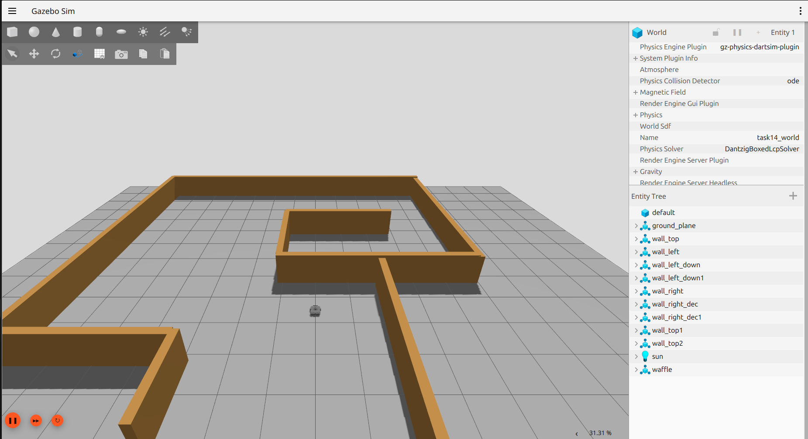

# Task 14 — Gazebo Autonomous Robot Simulation

## Overview
This package demonstrates a TurtleBot3 Waffle robot operating autonomously inside a custom Gazebo Harmonic world. The robot publishes velocity commands to `/cmd_vel` via a Python node (`autonomous_mover.py`) and moves through a maze-like environment without using Nav2 or SLAM.

## Package Contents
```
Task_14/
├── <ros2_package_name>/
│   ├── worlds/
│   │   └── <custom_world_file>.sdf
│   ├── launch/
│   │   └── gazebo_autonomous.launch.py
│   ├── <ros2_package_name>/
│   │   └── autonomous_mover.py
│   ├── package.xml
│   └── setup.py
├── screenshots/
│   ├── turtlebot_in_maze.png
│   └── launch_succesfull.png
└── README.md
```

## How the World Was Created
The custom Gazebo world was built to resemble the reference maze map provided in the task, using walls arranged with SDF/world-file primitives (boxes for walls) to create corridors and turns for the robot to navigate. The TurtleBot3 Waffle was given a clear, collision-free starting position at the entrance of the maze.

## How the Simulation Is Launched
The entire system (Gazebo + custom world + TurtleBot3 spawn + autonomous mover node) is started with a single command:
```bash
ros2 launch <ros2_package_name> gazebo_autonomous.launch.py
```
This launch file:
1. Starts Gazebo Harmonic with the custom world file.
2. Spawns the TurtleBot3 Waffle robot at the defined starting position.
3. Runs the `autonomous_mover.py` node, which begins publishing velocity commands.

## Nodes Started
| Node | Purpose |
|---|---|
| `gazebo` (via `ros_gz_sim`) | Runs the simulation environment and physics |
| `robot_state_publisher` | Publishes the robot's TF tree |
| `spawn_entity` | Spawns the TurtleBot3 Waffle into the world |
| `autonomous_mover.py` | Publishes `geometry_msgs/Twist` messages to `/cmd_vel` to drive the robot automatically |

## How the Robot Moves
`autonomous_mover.py` publishes linear and angular velocity commands directly to `/cmd_vel` on a timer, driving the robot forward and turning at intervals to navigate through the maze walls and obstacles — without relying on Nav2 path planning or SLAM-based localization.

## Screenshots

**Robot inside the world:**



**Launch command running successfully:**


## Demo Video

A 2–3 minute video explaining the world creation, simulation launch, nodes started, and robot motion via `/cmd_vel` is available here:

▶️ **[Watch on YouTube](https://youtu.be/e1bx62q4Mbs)**

[](https://youtu.be/e1bx62q4Mbs)
