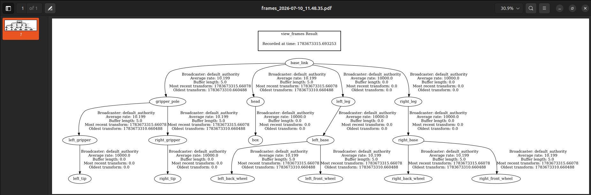
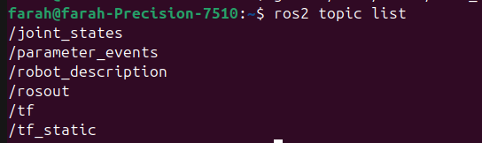
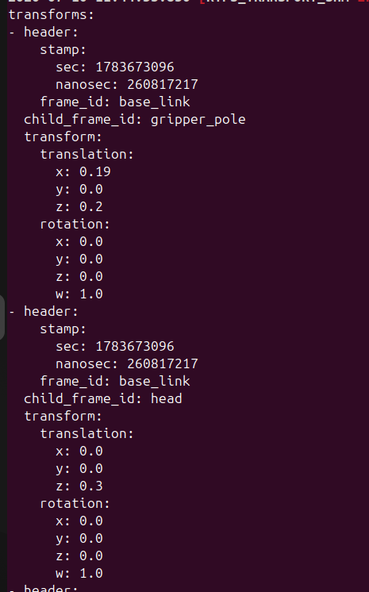
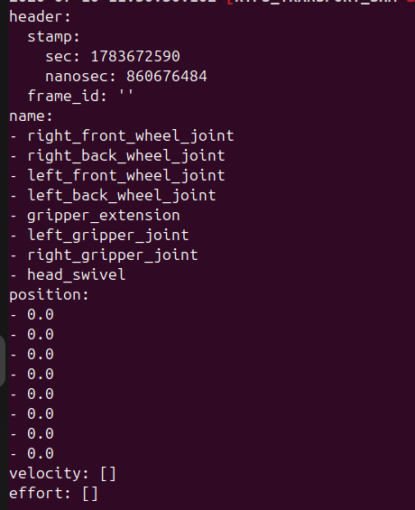
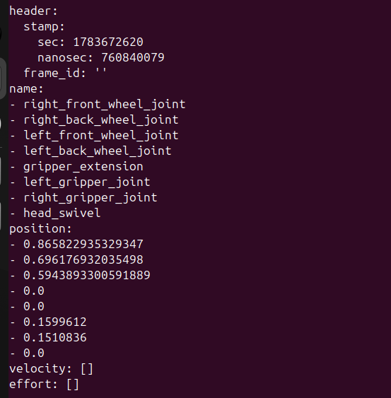
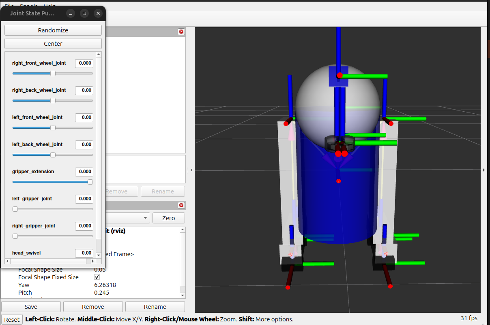
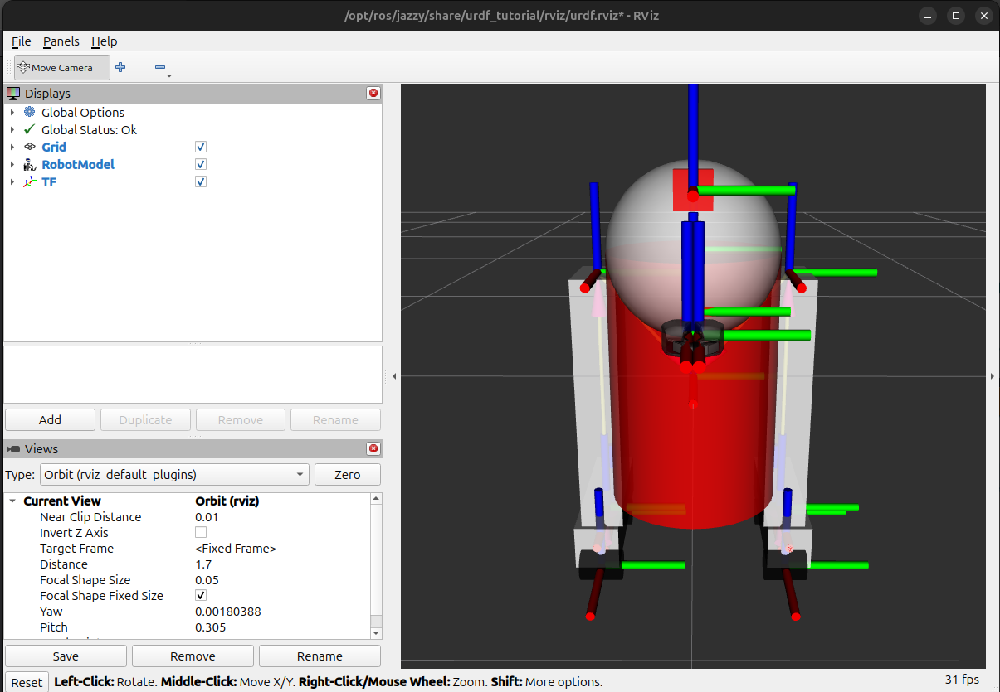

# Task_15 — URDF Robot Visualization

## Overview
This task explores how a robot is described using URDF, and how that description becomes a live, visualized robot in RViz. I used the ready-made `urdf_tutorial` package with the R2D2 model (`07-physics.urdf`), which is the most complete file in the tutorial — it includes fixed, continuous, and prismatic/revolute joints, so it's a good model for seeing every joint type in one place.

## How I Launched the Robot
```bash
sudo apt install ros-jazzy-urdf-tutorial
ros2 launch urdf_tutorial display.launch.py model:=urdf/07-physics.urdf
```
This launch file starts three things together:
- **`robot_state_publisher`** — reads the URDF and publishes the fixed geometric relationships between links as TF transforms.
- **`joint_state_publisher_gui`** — shows a slider for every non-fixed joint and publishes the current joint angles/positions on `/joint_states`.
- **RViz** — subscribes to the robot description and TF, and draws the robot model.

## Links and Joints

### What is a link?
A link is one rigid body of the robot — a physical part with its own visual shape, collision shape, and (optionally) mass/inertia. Links don't move relative to themselves; only the joints connecting them move.

### What is a joint?
A joint defines how two links are connected and how one can move relative to the other. Every joint has a **parent** link and a **child** link — URDF is a tree, so the child's position is always defined relative to its parent.

### 3 Links Explained

| Link | Description | Visual geometry |
|---|---|---|
| `base_link` | The robot's main body/torso, the root of the whole tree | Cylinder (`length=0.6`, `radius=0.2`) |
| `right_leg` | A support leg attached to the side of the body | Box (`size = 0.6 x 0.1 x 0.2`) |
| `gripper_pole` | A pole extending from the front of the body that the gripper fingers attach to | Cylinder, positioned forward of `base_link` |

### 3 Joints Explained

| Joint | Type | Parent → Child | Meaning of `origin` |
|---|---|---|---|
| `base_to_right_leg` | `fixed` | `base_link` → `right_leg` | Offsets the leg's frame by `xyz="0 -0.22 0.25"` relative to `base_link` — this never changes, so the leg is rigidly bolted to the body |
| `head_swivel` | `continuous` | `base_link` → `head` | Sets the head's pivot point at `xyz="0 0 0.3"` above the body (confirmed in the `/tf` echo below); rotates freely around the Z axis with no angle limits, like a wheel spinning forever |
| `gripper_extension` | `prismatic` | `base_link` → `gripper_pole` | Sets the pole's starting frame at `xyz="0.19 0 0.2"` (confirmed in the `/tf` echo below); the joint then **slides** along one axis between `lower="-0.38"` and `upper="0"` meters — this is what lets the gripper arm extend and retract |

**On `origin`:** every `<origin xyz="..." rpy="...">` tag defines a translation (`xyz`) and rotation (`rpy` — roll/pitch/yaw in radians) from the parent frame to the child frame. Inside a joint, it places *where the child link starts*. Inside a link's `<visual>`, it offsets the *shape* within that link's own frame (used so a box or cylinder doesn't have to be centered on the link's origin).

**Joint types used here:**
- `fixed` — no motion at all, rigidly welds two links together (used for the leg, feet, and gripper fingertips)
- `continuous` — rotates around one axis with no limits (head, wheels)
- `revolute` — rotates around one axis but *with* limits (`left_gripper_joint`, `right_gripper_joint`, limited to 0–0.548 rad)
- `prismatic` — slides along one axis with limits, in meters not radians (`gripper_extension`)

## TF Tree
Every link in the URDF gets its own TF frame, and `robot_state_publisher` broadcasts the transform between each parent and child frame based on the joint definitions and the live `/joint_states` values. The tree is rooted at `base_link`, branching out into four groups: `gripper_pole → left_gripper/right_gripper → left_tip/right_tip`, `head → box`, `left_leg → left_base → left_front_wheel/left_back_wheel`, and `right_leg → right_base → right_front_wheel/right_back_wheel`. RViz uses this tree to know exactly where to draw every shape in 3D space.

```bash
ros2 run tf2_tools view_frames
```


## Exploring the System

**Active topics:**
```bash
ros2 topic list
```


**Live transform broadcasts** — this confirms the `origin` values from the URDF joints (e.g. `gripper_pole` at `x: 0.19, z: 0.2` relative to `base_link`, `head` at `z: 0.3`):
```bash
ros2 topic echo /tf
```


**Joint states before moving the sliders** — all joints start at `0.0`:
```bash
ros2 topic echo /joint_states
```


**Joint states after moving the sliders** — the wheel joints, gripper extension, and gripper joints now show non-zero values, matching the slider positions in the GUI:


## Simple Modification
I copied `07-physics.urdf` into this `Task_15` folder and changed the **material color** of `base_link` from **blue** to **red**:

```xml
<material name="red">
  <color rgba="1 0 0 1"/>
</material>
```

**Before (original red body):**


**After (red body, shown with the Joint State Publisher GUI open):**


**Result in RViz:** the body cylinder changed color from blue to red, with no effect on the robot's geometry, joints, or TF tree — this confirms that `<material>` is a purely visual property and doesn't affect the physical/kinematic description of the robot.

## Video
📹 [Watch the explanation video here](https://youtu.be/X8FxVEGIzlM)


