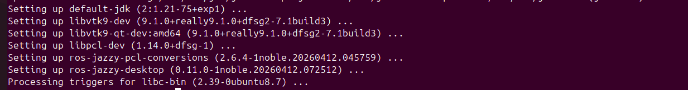
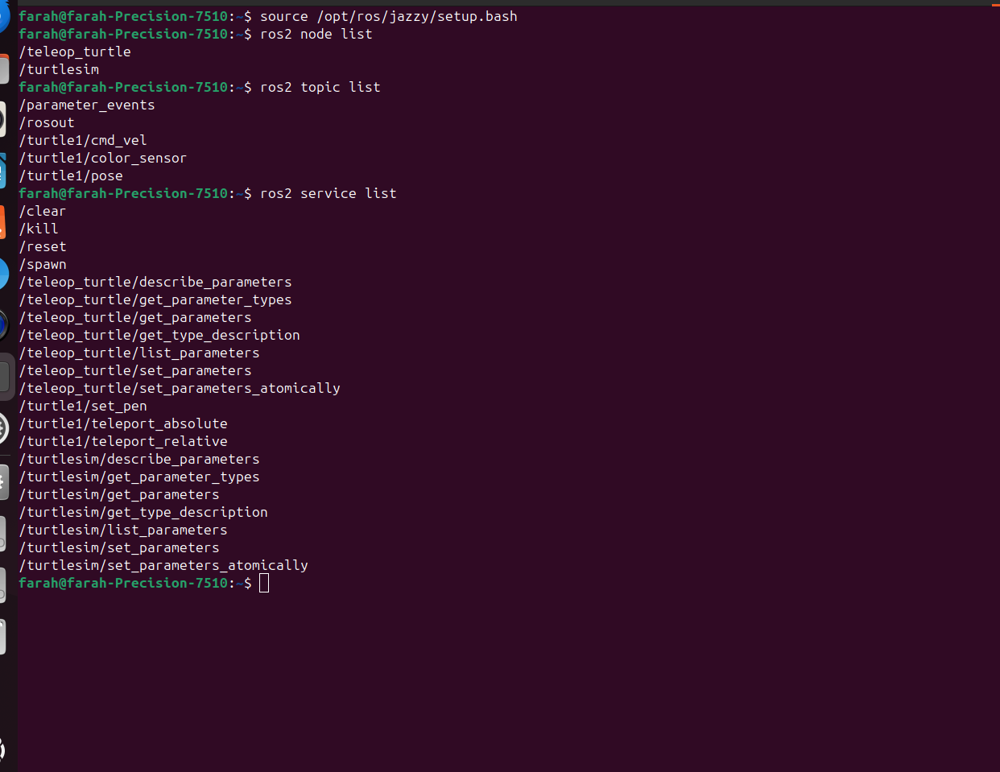
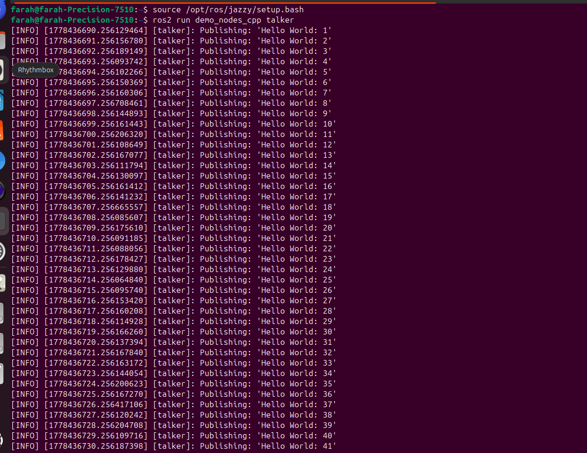
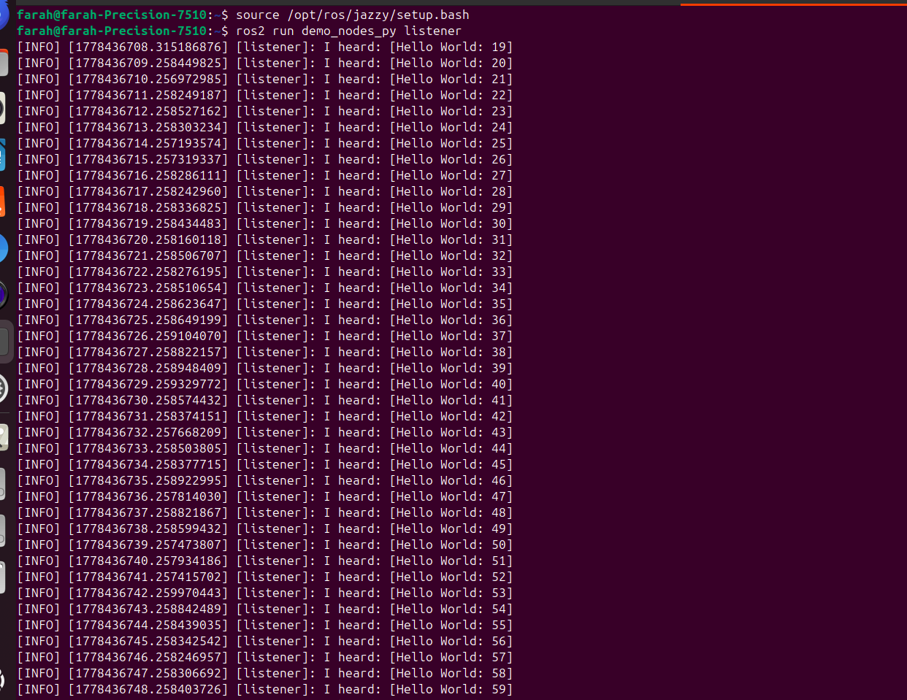
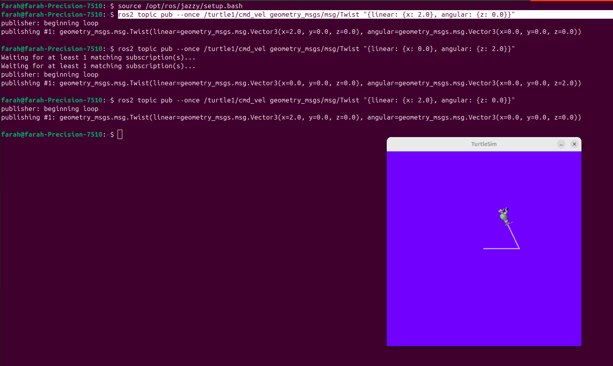
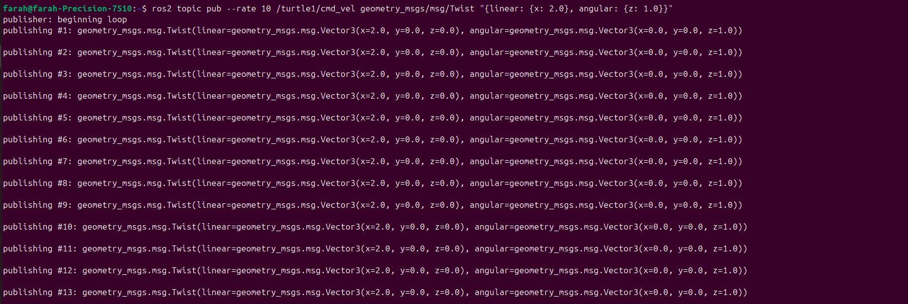
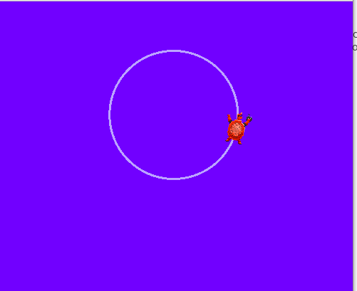
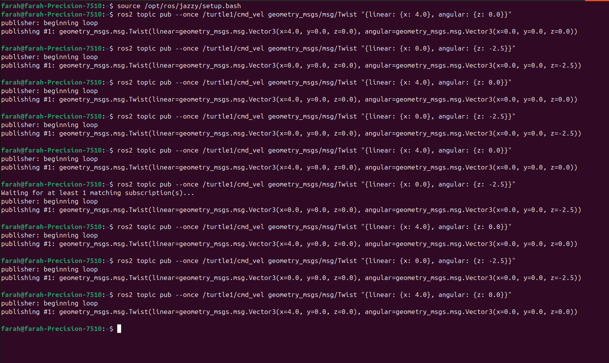
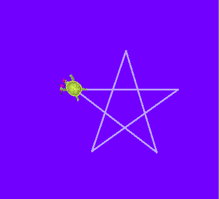

# Task 10 — ROS 2 Turtlesim Control

## Successful Installation

The ROS 2 Jazzy desktop was installed successfully, including all required packages such as `ros-jazzy-desktop`, `libpcl-dev`, and `libvtk9-dev`.



---

## Nodes, Topics, and Services

### Terminal Output



### Active Nodes
- `/turtlesim` — runs the simulation window and controls the turtle
- `/teleop_turtle` — reads keyboard input and sends movement commands

### Active Topics
- `/turtle1/cmd_vel` — receives movement commands (linear and angular velocity)
- `/turtle1/pose` — continuously publishes the turtle's current position
- `/turtle1/color_sensor` — publishes the color under the turtle's pen
- `/parameter_events`, `/rosout` — internal ROS 2 system topics

### Active Services
- `/clear` — removes all drawings from the screen
- `/reset` — returns the turtle to its starting position
- `/spawn` — creates a new turtle in the simulation
- `/kill` — removes a turtle from the simulation
- `/turtle1/set_pen` — changes the pen color or thickness
- `/turtle1/teleport_absolute` / `/teleport_relative` — instantly moves the turtle

---

## Notes: Nodes, Topics, and Services

**Nodes** are independent running programs in ROS 2. Each node performs a specific task such as controlling a robot, processing sensor data, or running a simulation. In this task, `/turtlesim` displays and controls the turtle, while `/teleop_turtle` handles keyboard input.

**Topics** are communication channels used for continuous data exchange between nodes. One node publishes data to a topic and other nodes subscribe to receive it. For example, `/turtle1/cmd_vel` is used to send movement commands to the turtle, and `/turtle1/pose` provides the turtle's real-time position.

**Services** are used for one-time request and response actions. Unlike topics, they do not continuously stream data — a node sends a single request and receives a single response. For example, `/clear` removes all drawings from the screen and `/reset` returns the turtle to its initial state.

---

## Talker and Listener Nodes

The talker node (`demo_nodes_cpp talker`) publishes "Hello World" messages continuously to a topic.



The listener node (`demo_nodes_py listener`) subscribes to that topic and prints every message it receives.



This demonstrates the basic **publish/subscribe** pattern in ROS 2.

---

## Manual Control (Teleop)

The turtle was controlled manually using keyboard input via the `teleop_turtle` node. Arrow keys move the turtle forward/backward and rotate it left/right.



---

## Drawing a Circle

### Command Used
```bash
ros2 topic pub --rate 10 /turtle1/cmd_vel geometry_msgs/msg/Twist "{linear: {x: 2.0}, angular: {z: 1.0}}"
```





### Why `--rate` is Used
The `--rate 10` flag publishes the command **10 times per second** continuously. Without it, the command would be sent only once and the turtle would stop immediately. Continuous publishing keeps the turtle moving in a smooth circle.

### Linear x / Angular z Logic
- **`linear.x`** controls forward speed
- **`angular.z`** controls rotation speed — positive turns left, negative turns right
- Both together make the turtle move in a circle

---

## Drawing a Manual Star

### Commands Used

```bash
ros2 topic pub --once /turtle1/cmd_vel geometry_msgs/msg/Twist "{linear: {x: 4.0}, angular: {z: 0.0}}"
ros2 topic pub --once /turtle1/cmd_vel geometry_msgs/msg/Twist "{linear: {x: 0.0}, angular: {z: -2.5}}"
```

Repeat 5 times to complete the star.





### Difference: Manual vs Teleop Movement

| | Teleop | Terminal pub |
|---|---|---|
| Control | Keyboard arrow keys | Terminal commands |
| Movement | Real-time continuous | One command at a time |
| Precision | Low | High — exact values |

---

## Demo Video

[Watch Demo Video](https://youtu.be/45aBlb0mNTQ)
