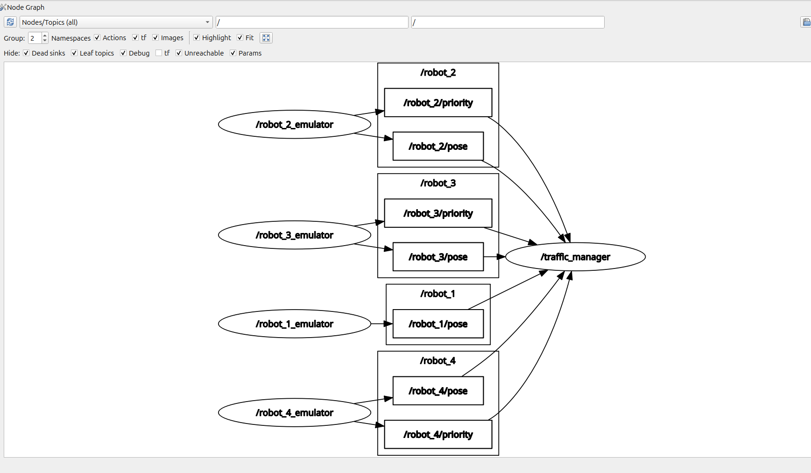
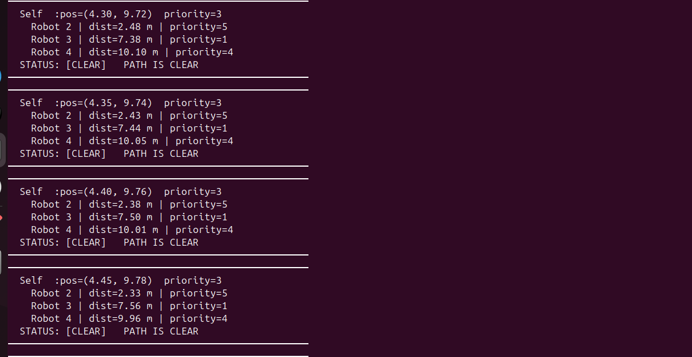
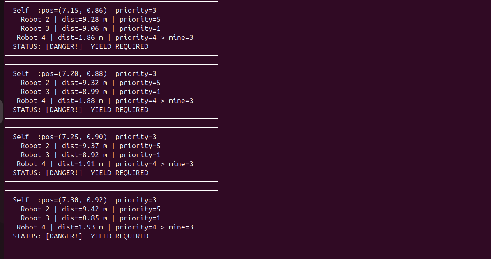

# Task 11 — Autonomous Traffic Manager

## Overview

A decentralised ROS 2 system where multiple warehouse robots broadcast their position and priority, and a traffic manager applies a **Yielding Protocol** to avoid collisions — with no central controller.

---

## File Structure

```
Task_11/
 fleet_emulator.py  : Simulates 4 robots broadcasting pose and priority
 traffic_manager.py : Controller for Robot 1 with yielding logic
 README.md
```

---

## How to Run

**Terminal 1 — Start the fleet:**
```bash
cd ~/ros2_ws
source /opt/ros/jazzy/setup.bash
source install/setup.bash
ros2 run task_11 fleet_emulator
```

**Terminal 2 — Start the traffic manager:**
```bash
cd ~/ros2_ws
source /opt/ros/jazzy/setup.bash
source install/setup.bash
ros2 run task_11 traffic_manager
```

**Terminal 3 — View the RQT graph:**
```bash
source /opt/ros/jazzy/setup.bash
rqt_graph
```

### Nodes/Topics (all) view


---

## Terminal Output

### [CLEAR] — Path is safe


### [DANGER] — Yield required


---

## Yielding Protocol — Math

### Distance Calculation (Euclidean)

```
distance = √( (x_other − x_self)² + (y_other − y_self)² )
```

### Decision Rule

```
IF distance < 2.0 m  AND  other_priority > 3
THEN → [DANGER] yield required
ELSE → [CLEAR]  path is safe
```

Both conditions must be true at the same time to trigger DANGER:
- Being **close** to a lower-priority robot → still CLEAR (Robot 1 has right of way)
- Being **far** from a higher-priority robot → still CLEAR (no collision risk)

---

## Synchronisation Between Position and Priority Streams

Each robot publishes on two independent topics — one for `Pose2D` and one for `Int32`. The `traffic_manager` subscribes to both streams for every robot and caches the latest value in a shared dictionary:

```python
self.fleet = {
    2: {"x": None, "y": None, "priority": None},
    3: {"x": None, "y": None, "priority": None},
    4: {"x": None, "y": None, "priority": None},
}
```

- The **pose callback** updates `x` and `y` whenever a `/robot_N/pose` message arrives.
- The **priority callback** updates `priority` whenever a `/robot_N/priority` message arrives.
- The **10 Hz decision timer** reads the latest snapshot of this dictionary every tick.

Since all callbacks and the timer run inside a single `SingleThreadedExecutor`, they never interleave — no locking is needed. A robot entry is only evaluated once both `x` and `priority` are non-`None`, preventing any partial or stale reads at startup.

---

## Demo Video

[](https://youtu.be/x43_hS1JMk4)
